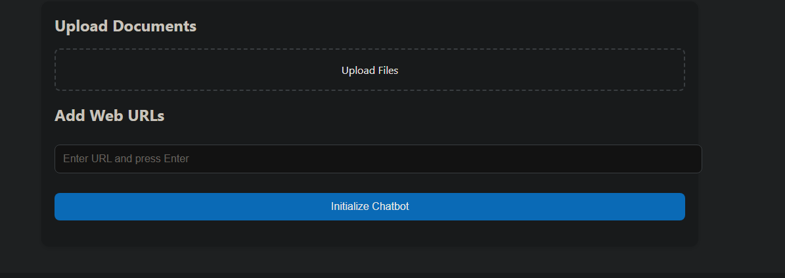

# Document-Based Chatbot

A chatbot that learns from your documents: Upload your own documents and the bot will embed them in a vector database. When you ask questions, it uses this stored knowledge to provide relevant answers based on your documents' content.

## Features

- Upload document files
- Add web URLs as knowledge sources
- Vector database storage using Chroma DB
- Interactive chat interface
- Document embedding for efficient retrieval

## Screenshots

### Chat Interface

*Chatbot interface showing the initialized state*

### Document Upload

*Document and URL upload interface*

## Project Structure
```
CHAT-BOT/
├── _pycache_/
├── chroma_db/      # Vector database storage
├── data/           # Data storage
├── templates/      # HTML templates
├── uploads/        # Uploaded files directory
├── .env           # Environment variables
├── .gitignore     # Git ignore rules
├── main.py        # Main application file
├── requirements.txt # Python dependencies
├── server.py      # Server configuration
└── test.ipynb     # Testing notebook
```

## Setup and Installation

1. Clone the repository
2. Install dependencies:
```bash
pip install -r requirements.txt
```
3. Set up your environment variables in `.env`
4. Run the server:
```bash
python server.py
```

## Usage

1. Access the web interface
2. Upload your documents or add URLs
3. Initialize the chatbot
4. Start asking questions about your documents

## Environment Variables

Create a `.env` file in the root directory and add your configuration:
```
# Add your required environment variables here
```

## Technologies Used

- Python
- ChromaDB for vector storage
- FastAPI/Flask (specify which one you're using)
- Document embedding models
